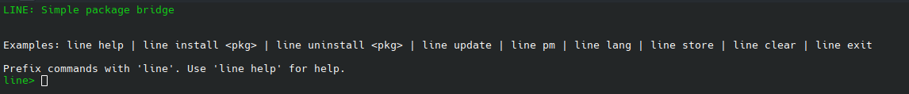
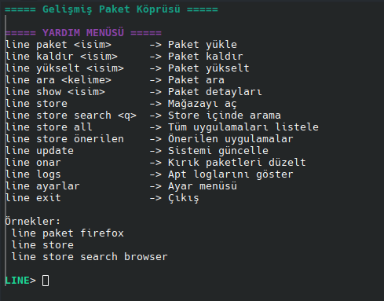
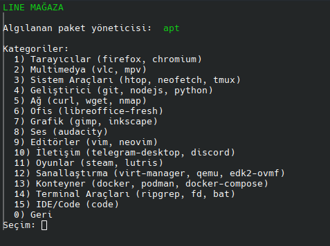

## LINE
apt paket yöneticisi için modern, hızlı ve interaktif bir terminal arayüzüdür.

## FEEDBACK
Yeni dil destekleri, dağıtım seçenekleri ve store güncellemesi
ile oluşan hataları veya önerileri zhduken@gmail.com adresine
bildirirseniz çok mutlu olurum :)

## UYARI 
Sh ve Bash için sorunsuz uyumludur! Fakat fish ve zsh'da hata verebilir!

## YENİ SÜRÜM

## Line 1.2.1 Büyük Güncelleme
- Çoklu dil desteği geldi
- Arch, Fedora uyumlu
- Büyük store yenilemesi
## ESKİ SÜRÜM

## Line 1.1
- Renkli arayüz
- Hatalar düzeltildi
- Mağaza kategorileri genişletidli
  


## Neden LINE
- Çok dil desteği
- Arch, Ubuntu ve Fedora uyumlu
- Basit ve Sade menü
- Hatalı paket kontrolü
- Renkli ve Fish tarzı arayüz
- Günceldir sürekli özellikler eklenir
- Line store özelliği ile daha yenilikçi

## STORE Güncellemesi



- Kolayca indirme
- Sürekli güncellenen menü
- Sh bilgisine gerek yok
- Yeni güncelleme ile daha çok seçenek
  
## Özellikler
- Çok dilli
- Otomatik dağıtım algılama
- Store özelliği
- Ayarlanabilir özellikler mevcut
- Renkli arayüz
- Hatalı paket kontrolü
- Paket arama, silme ve yükseltme
- Sistem güncelleme / yükseltme

## Kurulum
```bash
git clone https://github.com/Zhduken/LINE.git
cd LINE
chmod +x line.sh
./line.sh
```
## BAŞLATMA
```
./LINE/line.sh 
```
## OTOMATİK AÇMA
```
echo "bash /home/kullanici/line.sh" >> ~/.bashrc
```


