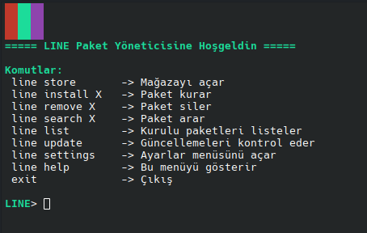
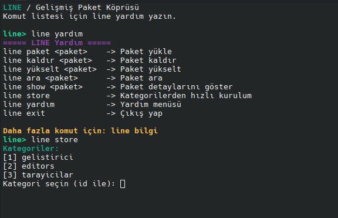

## LINE
apt paket yöneticisi için modern, hızlı ve interaktif bir terminal arayüzüdür.

## YENİ SÜRÜM

## Güncelleme Line 1.1
- Daha renkli arayüz
- Hatalar düzeltildi
- Mağaza kategorileri genişletidli
  
## ESKİ SÜRÜM


## Neden LINE
- Tamamen türkçe
- Basit ve Sade menü
- Hatalı paket kontrolü
- Renkli ve Fish tarzı arayüz
- Günceldir sürekli özellikler eklenir
- Line store özelliği ile daha yenilikçi
  
## Özellikler
- Türkçe destekli ve Yeni diller yakında eklenecek
- Ayarlanabilir özellikler mevcut
- Renkli arayüz
- Hatalı paket kontrolü
- Paket arama, silme ve yükseltme
- Sistem güncelleme / yükseltme

## Kurulum
```bash
git clone https://github.com/Zhduken/LINE.git
cd LINE
chmod +x line.sh
./LINE/line.sh 
```
## BAŞLATMA
```
./LINE/line.sh 
```
## OTOMATİK AÇMA
```
echo "bash /home/kullanici/line.sh" >> ~/.bashrc
```

